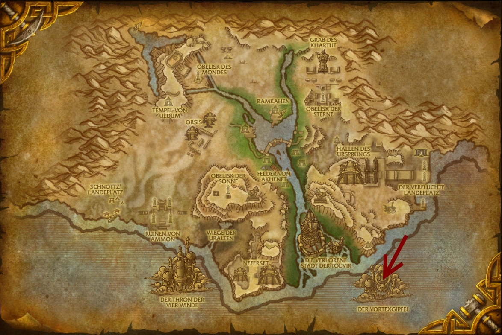
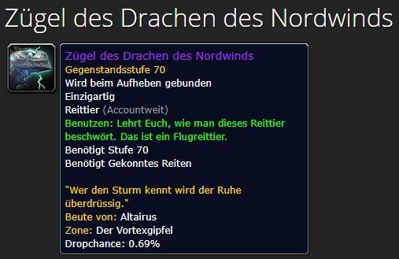

💰 WoW Legion Gold Guide 💰
💰 10.000 bis 70.000 Gold pro Stunde 💰 
💰 Flüchtige Luft 💰

Werde euch mal erklären wie Ihr mit ein wenig Farmen, schnell Gold erhalten könnt.

### Welche Vorraussetzungen braucht man?
- Level 110 Charakter
- Fliegen sollte man können.

### Wo und was wird gefarmt?
Es wird im Dungeon "Der Vortexgipfel" gefarmt.
Die Instanz befindet sich auf der Map "Uldum"
In der Instanz wird "Flüchtige Luft" gefarmt.

### Was muss ich beachten?
Wenn Ihr auf dem HC Mode die Instanz macht, farmt Ihr nur bis zum ersten Boss.
Kurz vor dem ersten Boss könnt Ihr in den Abgrund springen und werdet zum Eingang der Instanz zurück telepotiert.
Ihr verlasst die Instanz und macht einen Dungeon Reset.

Spielt Ihr allerdings auf "Normal" lohnt es sich bis zum zweiten Boss zu laufen, und ihn dann zu töten.
Bei ein wenig Glück könnt Ihr ein Mount erhalten.

### Wieso kaufen die Spieler Flüchtige Luft?
Flüchtige Luft ist ein Item als älteren Addons von WoW. Das Item hat nicht so hohe drop Chance, und damals
war es nicht so einfach das Item sich allein zu farmen.
Jetzt wird das Item nicht so wirklich gebraucht, allerdings ist in WoW der Trend zu Transmog Items.
Transmog Items werden von vielen Spielern gern gekauft, aber die meisten haben keine Lust sich alte Materialen 
zu erfarmen und zahlen lieber einiges an Gold um die Items sich aus dem Auktionshaus zu kaufen.

Wieviel Ihr im Endeffekt damit verdienen könnt hängt von eurem Server ab.
Solltet Ihr noch Fragen haben könnt Ihr gerne einen Kommentar hinterlassen.
